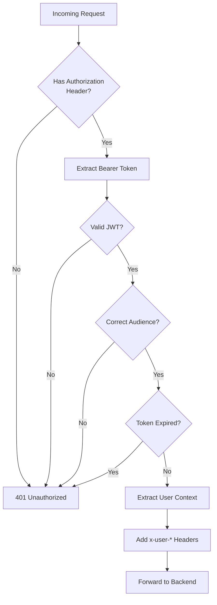
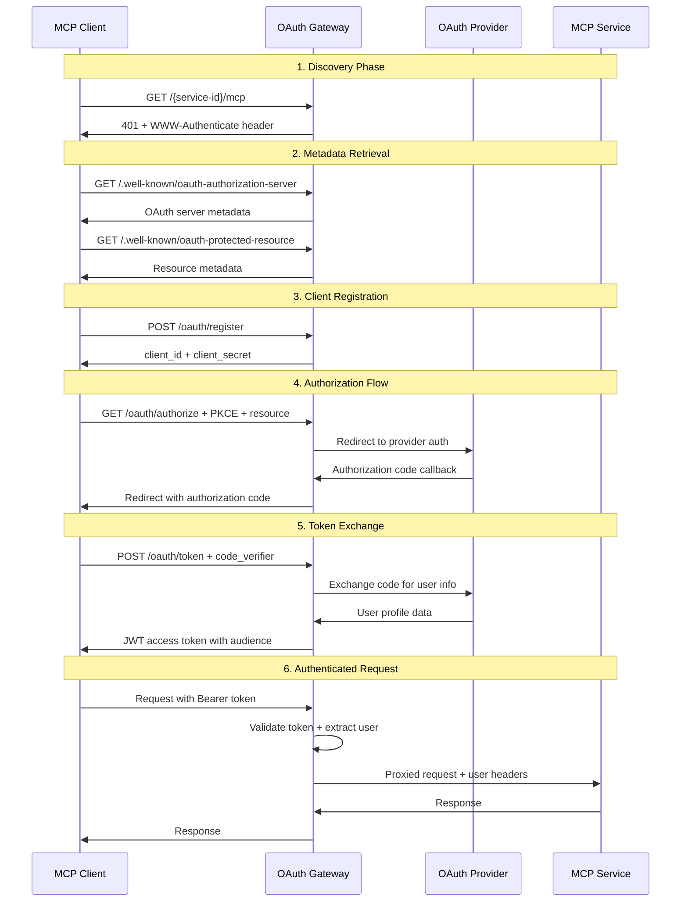
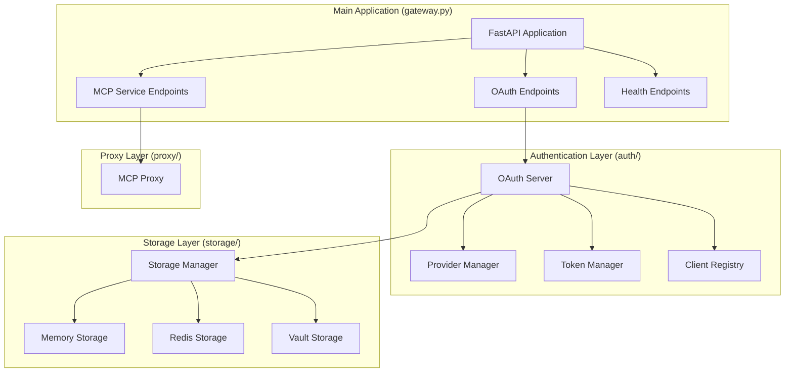

# Architecture & Design Decisions

Key design decisions and how the MCP OAuth Gateway integrates with the [Model Context Protocol](https://modelcontextprotocol.io/).

## Core Design Philosophy

**Transparent Authentication**: Add OAuth 2.1 to MCP services without code changes.

- **MCP clients** use standard protocols with automatic OAuth discovery
- **MCP services** receive user context headers (no OAuth code needed)
- **Users** get familiar OAuth flows (Google, GitHub, etc.)
- **Developers** focus on MCP logic, not authentication

## Key Design Decisions

### 1. Streamable HTTP Transport Only

**Decision**: Gateway only supports [Streamable HTTP transport](https://modelcontextprotocol.io/specification/2025-06-18/basic/transports#streamable-http-transport).

**Why**:
- **HTTP Proxy Pattern**: Gateway acts as reverse proxy - natural fit for HTTP
- **OAuth Integration**: OAuth 2.1 flows designed for HTTP interactions
- **Production Ready**: HTTP patterns well-understood for scaling, TLS, load balancing
- **Simplicity**: Single transport keeps gateway focused and reliable

**Implication**: Your MCP services must support HTTP transport.

### 2. Single OAuth Provider

**Decision**: Only one OAuth provider per gateway instance.

**Why**:
- **OAuth 2.1 Compliance**: [Resource parameter (RFC 8707)](https://datatracker.ietf.org/doc/html/rfc8707) requires consistent token audiences
- **Token Scoping**: Service-specific tokens prevent privilege escalation
- **User Experience**: Single sign-on across all MCP services
- **Security**: Simpler trust model

**Configuration**:
```yaml
# ✅ Correct: Single provider
oauth_providers:
  google:
    client_id: "${GOOGLE_CLIENT_ID}"
    client_secret: "${GOOGLE_CLIENT_SECRET}"

mcp_services:
  service1:
    oauth_provider: "google"  # All services use same provider
  service2:
    oauth_provider: "google"
```

### 3. Token Isolation (Critical Security)

**Decision**: OAuth tokens are **never passed** to backend MCP services.



**Why**:
- **Security Isolation**: Backend services can't access or misuse tokens
- **Separation of Concerns**: Gateway handles auth, services handle logic  
- **Token Safety**: No risk of backends logging/caching OAuth tokens
- **Simplicity**: MCP services focus on domain logic

**What Services Receive**:
```http
GET /mcp HTTP/1.1
MCP-Protocol-Version: 2025-06-18
x-user-id: google_123456789
x-user-email: user@example.com
x-user-name: John Doe
x-user-provider: google
```

### 4. Service-Specific Token Audiences

**Decision**: Each service gets tokens with unique audiences.

**Token Structure**:
```json
{
  "iss": "https://gateway.example.com",
  "aud": "https://gateway.example.com/calculator/mcp",  // Service-specific
  "sub": "google_123456789",
  "user_email": "user@example.com"
}
```

**Benefits**:
- **Service Isolation**: Calculator tokens can't access weather service
- **Privilege Prevention**: Fine-grained access control per service
- **Audit Trail**: Clear token usage tracking
- **RFC 8707 Compliance**: Proper resource parameter binding

### 5. MCP Authorization Compliance

**Decision**: Full implementation of [MCP Authorization Specification](https://modelcontextprotocol.io/specification/2025-06-18/basic/authorization).

**Complete OAuth 2.1 Flow**:


**Standards**:
- **OAuth 2.1**: PKCE required, refresh token rotation
- **RFC 7591**: Dynamic Client Registration
- **RFC 8414/9728**: Metadata endpoints
- **RFC 8707**: Resource parameter binding

### 6. Production Storage Architecture

**Decision**: Multiple storage backends with automatic fallback.



**Strategy**:
- **Memory**: Development, no dependencies
- **Redis**: Production, clustering support
- **Vault**: Enterprise, encryption, audit
- **Fallback**: Gateway continues if storage fails

## Implementation Architecture

The gateway uses a component-based architecture. Key components:

**Core**: `McpGateway` orchestrates everything ([source](https://github.com/akshay5995/mcp-oauth-gateway/blob/main/src/gateway.py))  
**Auth**: OAuth 2.1 server with provider management ([auth/](https://github.com/akshay5995/mcp-oauth-gateway/tree/main/src/auth))  
**Proxy**: HTTP proxy with token removal and user context injection ([proxy/](https://github.com/akshay5995/mcp-oauth-gateway/tree/main/src/proxy))  
**Storage**: Configurable backends with fallback ([storage/](https://github.com/akshay5995/mcp-oauth-gateway/tree/main/src/storage))

## Security Model

**Multi-layer protection**:
- **Origin Validation**: DNS rebinding protection
- **Protocol Validation**: MCP version enforcement  
- **Token Isolation**: No OAuth tokens reach backends
- **PKCE**: Required for all authorization flows
- **Audience Binding**: Service-specific token scoping

### 7. Browser Client Support

**Decision**: CORS configuration with exposed headers for browser-based MCP clients.

**Why Browser Support Matters**:
- Web-based MCP clients need access to custom headers
- Session management requires header visibility
- OAuth flows work naturally in browsers

**Configuration for Browser Clients**:
```yaml
cors:
  allow_origins: ["https://your-web-app.com"]  # Your web app's domain
  allow_credentials: true                       # Required for cookies/auth
  expose_headers:                               # Headers browser can access
    - "MCP-Session-ID"                         # Session tracking
    - "X-Request-ID"                           # Request correlation
    - "X-Rate-Limit-Remaining"                # Usage tracking
```

**What This Enables**:
- **Session Persistence**: Browser can read and store `MCP-Session-ID`
- **Request Tracking**: Correlate requests with `X-Request-ID`
- **Rate Limit Awareness**: Display usage with rate limit headers

**Example Browser Client**:
```javascript
// Browser can now access exposed headers
const response = await fetch('https://gateway.example.com/service/mcp', {
  headers: {
    'Authorization': 'Bearer ' + accessToken,
    'MCP-Protocol-Version': '2025-06-18'
  }
});

// Access exposed headers
const sessionId = response.headers.get('MCP-Session-ID');
const requestId = response.headers.get('X-Request-ID');
```

**Security Note**: Only expose headers that browser clients need. Avoid exposing sensitive internal headers.

## Why These Decisions?

**Focus**: Do one thing well - transparent OAuth for MCP HTTP services  
**Security**: OAuth 2.1 compliance with enterprise features  
**Simplicity**: Minimal integration effort for MCP services  
**Standards**: MCP specification compliance with proper discovery

## Resources

**MCP Specs**: [Authorization](https://modelcontextprotocol.io/specification/2025-06-18/basic/authorization) · [HTTP Transport](https://modelcontextprotocol.io/specification/2025-06-18/basic/transports#streamable-http-transport)  
**OAuth Standards**: [OAuth 2.1](https://datatracker.ietf.org/doc/html/draft-ietf-oauth-v2-1) · [RFC 8707](https://datatracker.ietf.org/doc/html/rfc8707) · [RFC 7591](https://datatracker.ietf.org/doc/html/rfc7591)  
**Development**: [GitHub](https://github.com/akshay5995/mcp-oauth-gateway) · [CLAUDE.md](https://github.com/akshay5995/mcp-oauth-gateway/blob/main/CLAUDE.md) · [Tests](https://github.com/akshay5995/mcp-oauth-gateway/tree/main/tests)

→ [Quick Start](./quick-start) to get hands-on with the gateway